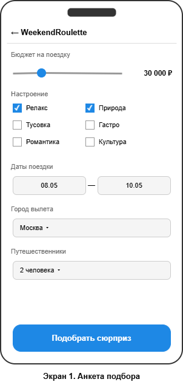
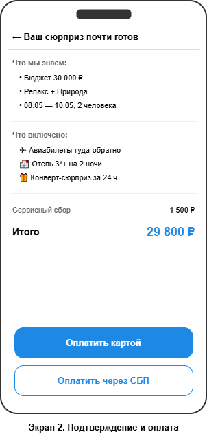
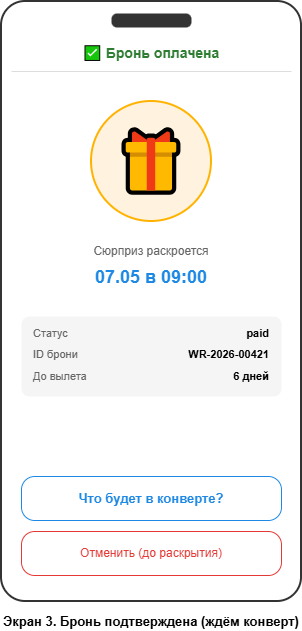
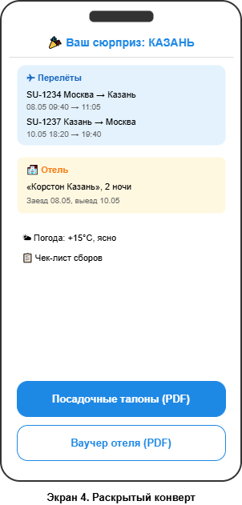

# Управление IT-проектами

**Студент:** Шпакова Д.
**Группа:** WEB-13
**Бизнес-модель:** B2C (Business-to-Consumer)

## Навигация по проекту

- [Практическое задание №1 — Elevator Pitch и Lean Canvas](#практическое-задание-1-elevator-pitch-и-lean-canvas)
- [Практическое задание №2 — Требования и продуктовые риски](#практическое-задание-2-требования-и-продуктовые-риски)
- [Практическое задание №3 — Системный анализ](#практическое-задание-3-системный-анализ)
- [Практическое задание №4 — Архитектура](#практическое-задание-4-архитектура)
- [Практическое задание №5 — Процессы разработки и команда](#практическое-задание-5-процессы-разработки-и-команда)
- [Практическое задание №6 — Риски проекта](#практическое-задание-6-риски-проекта)

---
# Практическое задание №1. Elevator Pitch и Lean Canvas

## Проект: WeekendRoulette
**Суть:** Сервис бронирования поездок-сюрпризов на выходные. Избавляем от стресса планирования и дарим чистые эмоции.

### Elevator Pitch

Городские жители, которым нужна эмоциональная перезагрузка на выходные, часто теряют драгоценное время и нервы на самостоятельный поиск билетов и отелей. Мы — мобильное приложение `WeekendRoulette` для бронирования поездок-сюрпризов. В отличие от обычных агрегаторов и турагентств, мы просим указать только бюджет и цель отдыха, а всю организацию берем на себя. Куда именно летит клиент, он узнает только за 24 часа до вылета, получая письмо-сюрприз с посадочными талонами. В результате пользователи получают отдых без стресса планирования, а мы зарабатываем на сервисном сборе и партнерских комиссиях. Готовы рискнуть? Давайте прямо сейчас покрутим нашу тестовую рулетку на вашем телефоне и посмотрим, куда бы вы отправились в эту пятницу!

---
### Lean Canvas

#### 1. Сегменты потребителей
* **Целевая аудитория:** Выгоревшие офисные сотрудники (миллениалы/зумеры); пары, ищущие новые эмоции.
* **Ранние последователи:** Люди, которые часто ездят в короткие поездки на выходные (сити-брейки).

#### 2. Проблема
* Планирование отдыха вызывает стресс.
* Нехватка времени на поиск стыковок и отелей.
* Усталость от рутины.
* **Существующие альтернативы:** Самостоятельный поиск на агрегаторах, покупка стандартных пакетных туров в агентстве, остаться дома.

#### 3. Уникальная ценность
* Эмоциональная перезагрузка без стресса планирования. Вы выбираете бюджет и настроение, мы берем на себя всю рутину и дарим элемент приятного сюрприза.

#### 4. Решение
* Мобильное приложение для бронирования "вслепую".
* Подбор билетов и отелей по заданному бюджету.
* Рассылка-сюрприз за 24 часа до вылета.

#### 5. Каналы
* Таргетинг (Reels/TikTok с живыми эмоциями распаковки "сюрприза").
* Интеграции с Travel-блогерами.
* Контекстная реклама по запросам "куда поехать на выходные".

#### 6. Потоки прибыли
* Сервисный сбор с клиента за каждую поездку.
* B2B-комиссии от отелей и авиакомпаний за приведенных клиентов.
* Продажа подарочных сертификатов на "сюрприз-путешествие".

#### 7. Структура издержек
* Разработка и поддержка мобильного приложения.
* Зарплата разработчиков, маркетологов и службы поддержки 24/7.
* Бюджет на маркетинг и PR.

#### 8. Ключевые метрики
* **Стоимость привлечения клиента**
* **Коэффициент удержания** — какой процент клиентов возвращается за повторными покупками
* **Индекс лояльности** — насколько охотно пользователи рекомендуют сервис друзьям

#### 9. Скрытое преимущество
* Умный алгоритм стыковки горящих предложений.
* Эксклюзивные контракты с отелями на выкуп пустующих номеров "вслепую" с большой скидкой.


# Практическое задание №2. Требования и продуктовые риски


## 1. Роли

| Роль | Описание |
|---|---|
| **Путешественник** | Основной B2C-пользователь. Покупает поездку-сюрприз. |
| **Контент-менеджер** | Сотрудник, наполняющий каталог направлений, отелей, тематических подборок. |
| **Поддержка (Support)** | Решает проблемы пользователей: возвраты, форс-мажор, перенос дат. |
| **Партнёр (отель / авиакомпания)** | Поставляет инвентарь и горящие предложения. Работает через партнёрский кабинет. |
| **Админ** | Управляет ролями, тарифами, юр. документами, безопасностью. |

---

## 2. User Stories

Формат: «Как [роль], я хочу [действие], чтобы [ценность]».

### Путешественник (основной путь)

1. Как путешественник, я хочу указать бюджет и настроение, чтобы получить персональную поездку без ручного поиска.
2. Как путешественник, я хочу выбрать даты и города вылета, чтобы поездка вписалась в мой график.
3. Как путешественник, я хочу оплатить поездку картой или СБП, чтобы мгновенно подтвердить бронь.
4. Как путешественник, я хочу получить «конверт-сюрприз» за 24 часа до вылета, чтобы вовремя собрать чемодан.
5. Как путешественник, я хочу видеть в приложении посадочные талоны и ваучеры отеля, чтобы не искать письма в почте.
6. Как путешественник, я хочу указать табу-страны и аллергии, чтобы сюрприз не оказался неприятным.
7. Как путешественник, я хочу получать push-уведомления о статусе брони, чтобы быть в курсе изменений.
8. Как путешественник, я хочу отменить или перенести поездку до раскрытия направления, чтобы не терять деньги при форс-мажоре.
9. Как путешественник, я хочу оценить поездку после возвращения, чтобы повлиять на алгоритм подбора в следующий раз.
10. Как путешественник, я хочу подарить поездку-сюрприз другу через сертификат, чтобы порадовать близкого.
11. Как путешественник, я хочу видеть историю своих поездок, чтобы делиться впечатлениями и не повторяться.

### Поддержка / Контент-менеджер / Партнёр

12. Как сотрудник поддержки, я хочу видеть очередь обращений с фильтрами по статусу брони, чтобы быстро отвечать.
13. Как поддержка, я хочу отменить бронь и инициировать возврат, чтобы помочь клиенту при форс-мажоре.
14. Как контент-менеджер, я хочу добавлять новые направления и тематические подборки, чтобы расширять каталог.
15. Как партнёр, я хочу загружать тарифы и квоты номеров, чтобы продавать пустующий инвентарь.
16. Как админ, я хочу настраивать сервисный сбор и юридические документы, чтобы соответствовать законодательству.

---

## 3. Приоритизация — RICE

Шкалы из лекции: Reach 1–3 · Impact 1–3 · Confidence 1–3 · Effort 1–3. RICE = R × I × C / E.

| # | История | R | I | C | E | RICE |
|---|---|---|---|---|---|---|
| 1 | Указать бюджет и настроение | 3 | 3 | 3 | 2 | **13.5** |
| 2 | Выбрать даты и города вылета | 3 | 3 | 3 | 1 | **27.0** |
| 3 | Оплатить картой / СБП | 3 | 3 | 3 | 2 | **13.5** |
| 4 | Получить «конверт-сюрприз» за 24 ч | 3 | 3 | 3 | 1 | **27.0** |
| 5 | Посадочные талоны и ваучеры в приложении | 3 | 2 | 2 | 2 | **6.0** |
| 6 | Табу-страны и аллергии | 2 | 3 | 2 | 1 | **12.0** |
| 7 | Push-уведомления о статусе | 3 | 2 | 3 | 1 | **18.0** |
| 8 | Отмена / перенос до раскрытия | 2 | 3 | 2 | 2 | **6.0** |
| 9 | Оценка поездки | 2 | 1 | 2 | 1 | **4.0** |
| 10 | Подарочный сертификат | 1 | 2 | 1 | 2 | **1.0** |
| 11 | История поездок | 2 | 1 | 3 | 1 | **6.0** |
| 12 | Очередь обращений в поддержке | 1 | 3 | 3 | 2 | **4.5** |
| 13 | Отмена брони сотрудником поддержки | 1 | 3 | 3 | 1 | **9.0** |
| 14 | Каталог направлений | 1 | 3 | 3 | 2 | **4.5** |
| 15 | Партнёрский кабинет | 1 | 2 | 2 | 3 | **1.3** |
| 16 | Админка тарифов и юр. документов | 1 | 2 | 3 | 2 | **3.0** |

---

## 4. MVP и MLP

### MVP
- Указать бюджет и настроение (#1)
- Выбрать даты и города вылета (#2)
- Оплатить картой / СБП (#3)
- Получить «конверт-сюрприз» за 24 ч (#4)
- Push-уведомления о статусе (#7)
- Отмена / перенос до раскрытия (#8)
- Очередь обращений и отмена брони поддержкой (#12, #13)
- Каталог направлений и админка тарифов (#14, #16)

### MLP
- Табу-страны и аллергии (#6)
- Посадочные талоны и ваучеры в приложении (#5)
- Оценка поездки и история (#9, #11)
- Подарочный сертификат (#10)
- Партнёрский кабинет (#15)

---

## 5. Детальные требования для 2 главных историй MVP

### История А. «Указать бюджет и настроение»

**Функциональные требования (ФТ):**
- Система запрашивает у пользователя бюджет в рублях (минимум 5 000 ₽, максимум 200000 ₽).
- Система предлагает выбрать одно или несколько настроений из закрытого списка (Релакс, Тусовка, Природа, Гастро, Романтика, Культура).
- Система запрашивает количество путешественников (1–4) и тип номера (Single / Double / Twin).
- Система предлагает указать табу-страны и аллергии (опционально, но сохраняется в профиле).
- Система валидирует, что хотя бы одно настроение выбрано и бюджет вписывается в минимальный коридор для выбранных дат.
- При нажатии «Подобрать сюрприз» система формирует подбор и переводит пользователя на экран оплаты.

**Нефункциональные требования (НФТ):**
- Подбор формируется не дольше 2 секунд.
- UI поддерживает iOS 15+ и Android 9+.
- Все вводимые данные шифруются в момент передачи (TLS 1.3).
- Форма доступна и при медленной сети (3G) — без блокирующих анимаций.
- Если бэкенд недоступен, пользователь видит понятный экран ошибки, а не падение приложения.

### История Б. «Получить конверт-сюрприз за 24 часа до вылета»

**Функциональные требования (ФТ):**
- Система автоматически запускает рассылку конверта ровно за 24 часа до времени вылета (±5 минут).
- Конверт содержит: пункт назначения, даты, маршрут, посадочные талоны (PDF + в приложении), ваучер отеля, погоду, чек-лист сборов.
- Система отправляет push-уведомление и e-mail одновременно.
- Если пользователь не открыл конверт через 30 минут — отправляется повторное напоминание.
- При раскрытии конверта запускается короткая анимация-сюрприз (можно отключить в настройках).

**Нефункциональные требования (НФТ):**
- Доставка push с надёжностью не ниже 99.5%.
- Содержимое конверта сохраняется офлайн в приложении (на случай отсутствия сети в дороге).
- Все PDF-документы подписаны и не могут быть подменены на стороне клиента.
- Алгоритм планировщика устойчив к рестартам сервиса.

# Практическое задание №3. Системный анализ


## 1. DDD — доменные зоны

Приложение разделено на 5 ограниченных контекстов. Внутри каждого — один и тот же язык в коде, БД, макетах и документах.

### 1.1. Подбор (Matching)
**Описание.** Алгоритм формирует поездку под бюджет, настроение и даты пользователя. Здесь живёт логика «рулетки».
**Глоссарий.** `Trip Request` — анкета пользователя; `Mood Tag` — тег настроения; `Destination Pool` — пул допустимых городов; `Match Score` — оценка соответствия предложения анкете; `Surprise Lock` — флаг, скрывающий направление от пользователя до 24 ч.

### 1.2. Бронирование и платежи (Booking & Payments)
**Описание.** Удержание инвентаря у партнёров, расчёт стоимости, приём платежа, выдача чека.
**Глоссарий.** `Booking` — бронь с состояниями `pending → paid → confirmed → revealed → completed → cancelled`(ожидающий → оплаченный → подтверждённый → раскрытый → завершенный → отмененный); `Hold` — резерв инвентаря; `Service Fee` — сервисный сбор; `Refund Rule` — правила возврата; `Receipt` — чек.

### 1.3. Конверт-сюрприз (Reveal)
**Описание.** Планировщик, который ровно за 24 часа до вылета раскрывает направление и доставляет документы.
**Глоссарий.** `Reveal Job` — отложенная задача; `Envelope` — пакет документов (билет, ваучер, чек-лист, погода); `Channel` — push / e-mail; `Reveal Window` — окно ±5 минут до целевого времени.

### 1.4. Профиль и предпочтения (Profile)
**Описание.** Учётная запись пользователя, табу-страны, аллергии, история поездок, программа лояльности.
**Глоссарий.** `Traveler` — пользователь B2C; `Taboo Country` — страна, исключаемая из подбора; `Loyalty Tier` — уровень в программе лояльности; `Preference Set` — набор настроек подбора.

### 1.5. Поддержка и партнёры (Support & Supply)
**Описание.** Внутренние инструменты: очередь обращений, кабинет партнёров с тарифами и квотами, админка.
**Глоссарий.** `Ticket` — обращение в поддержку; `Partner` — отель / авиакомпания; `Inventory` — квота номеров и мест; `SLA` — целевое время ответа; `Refund Case` — кейс возврата.

---

## 2. BDD — критический путь MVP

**Критический путь:** «Купить поездку-сюрприз» — пользователь заполняет анкету, оплачивает, получает бронь в статусе `paid`.

### Сценарий 1. Успешная покупка

```
Дано пользователь авторизован в приложении
И у пользователя привязана карта
И в его городе есть подходящие предложения на выбранные даты
Когда он указывает бюджет 30 000 ₽, настроения «Релакс» + «Природа» и даты 8–10 мая
И нажимает «Подобрать сюрприз»
И подтверждает оплату на экране подтверждения
Тогда система переводит бронь в статус paid
И отправляет push «Сюрприз готовится, конверт придёт за 24 часа до вылета»
И списывает деньги с карты
И ставит задачу планировщика Reveal на дату вылета минус 24 часа
```

### Сценарий 2. Отказ при оплате

```
Дано пользователь авторизован в приложении
И в его городе есть подходящие предложения на выбранные даты
Когда он заполняет анкету и нажимает «Оплатить»
И платёжный шлюз отвечает ошибкой «недостаточно средств»
Тогда система оставляет бронь в статусе pending
И возвращает пользователя на экран оплаты с пояснением ошибки
И инвентарь у партнёра удерживается ещё 15 минут (не освобождается мгновенно)
И push-уведомление об успешной оплате не отправляется
```

---

## 3. Wireframes — ключевые экраны

1. **Анкета подбора** — пользователь указывает бюджет, настроения, даты и город вылета.
2. **Подтверждение и оплата** — сводка по поездке и кнопки оплаты картой / СБП.
3. **Бронь подтверждена (Surprise Lock)** — статус `paid`, обратный отсчёт до раскрытия конверта.
4. **Раскрытый конверт** — направление, перелёты, отель, погода, PDF-документы.






---

## 4. API-First — JSON-контракты

### Ручка 1. `POST /v1/trips/match` — подбор поездки

**Запрос:**
```json
{
  "budget_rub": 30000,
  "moods": ["relax", "nature"],
  "date_from": "2026-05-08",
  "date_to": "2026-05-10",
  "origin_city": "MOW",
  "travelers": 2,
  "taboo_countries": ["TR"],
  "preferences": {
    "room_type": "double",
    "allergies": ["seafood"]
  }
}
```

**Ответ 200:**
```json
{
  "match_id": "m_8f3a21",
  "summary": {
    "includes": ["hotel_2_nights", "envelope_24h"],
    "service_fee_rub": 1500,
    "total_rub": 29800
  },
  "expires_at": "2026-05-02T18:30:00Z",
  "surprise_locked": true
}
```

**Ответ 400 — нет подходящих предложений:**
```json
{
  "error": "NO_MATCH",
  "message": "Не удалось подобрать поездку под ваши параметры. Попробуйте увеличить бюджет или расширить настроения.",
  "hints": ["increase_budget", "broaden_moods"]
}
```

### Ручка 2. `POST /v1/bookings` — оплата и создание брони

**Запрос:**
```json
{
  "match_id": "m_8f3a21",
  "payment_method": "card",
  "card_token": "tok_a7d…",
  "agree_terms": true
}
```

**Ответ 201:**
```json
{
  "booking_id": "WR-2026-00421",
  "status": "paid",
  "reveal_at": "2026-05-07T06:00:00Z",
  "departure_at": "2026-05-08T06:00:00Z",
  "amount_rub": 29800,
  "receipt_url": "https://receipts.weekendroulette.ru/WR-2026-00421.pdf"
}
```

**Ответ 402 — ошибка оплаты:**
```json
{
  "error": "PAYMENT_DECLINED",
  "message": "Платёжный шлюз отклонил операцию. Попробуйте другую карту или СБП.",
  "retry_after_seconds": 0,
  "hold_expires_at": "2026-05-02T18:45:00Z"
}
```
# Практическое задание №4. Архитектура


## 1. C4, уровень 1 — Контекст

Показывает систему целиком и её отношения с пользователями и внешними сервисами. Без технологий.


---

## 2. C4, уровень 2 — Контейнеры

Показывает запускаемые приложения внутри системы и стек технологий.


---

## 3. Стек технологий и обоснование

### Контейнеры из диаграммы

| Контейнер / система | Технология | Почему именно она |
|---|---|---|
| Мобильное приложение | **Swift (iOS) + Kotlin (Android)** | Нативная производительность критична для анимации «раскрытия конверта» и push. Две команды быстрее одной кросс-платформенной. |
| Веб-приложение | **React + TypeScript** | Внутренняя аудитория, быстрый CRUD, типизация защищает от ошибок при росте кодовой базы. |
| Бэкенд API | **Python 3.12 + FastAPI + Gunicorn** | FastAPI ускоряет API-First (автогенерация Swagger). Скорость разработки MVP важнее экстремальной нагрузки. |
| Фоновые задачи | **Celery + Celery beat + Redis** | Тяжёлые операции (подбор у GDS) и отложенные задачи (раскрытие конверта) выносим из API, чтобы не блокировать ответы. |
| Основная БД | **PostgreSQL 16** | ACID-транзакции — обязательны для денег и броней. JSONB-поля покрывают гибкие настройки. PostGIS — для геопоиска. |
| Хранилище файлов | **S3-совместимое Object Storage** | Посадочные талоны, ваучеры, фото — типовая задача для объектного хранилища. |
| Платежи | **ЮKassa + СБП** | Покрывают 99% B2C в РФ; чек уходит в ОФД автоматически по 54-ФЗ. |
| ОФД | **Сертифицированный оператор фискальных данных** | Требование 54-ФЗ для онлайн-продаж B2C. |
| Поставщики авиа | **Amadeus / Sabre (GDS)** | Глобальные системы бронирования, исторический стандарт travel-индустрии. |
| Поставщики отелей | **Прямые API партнёров + агрегаторы** | Гибридная схема: эксклюзивы напрямую, остальное через агрегатор. |
| Push | **APNs (iOS) + FCM (Android)** | Индустриальный стандарт, без альтернатив. |
| E-mail | **Транзакционный почтовый провайдер** (Mailgun / Unisender / Яндекс 360) | Дублирующий канал доставки конверта. Свой SMTP не поднимаем — высокая deliverability через готового провайдера. |
| Геоданные и погода | **Яндекс.Геокодер + Яндекс.Погода** | Локальные источники с лучшим покрытием РФ. |

**Принцип выбора стека:** «сначала работает — потом правильно — потом быстро». На MVP — Python/FastAPI. Когда упрёмся в производительность — переписываем его на Go без переделывания всего бэкенда.
# Практическое задание №5. Процессы разработки и команда


## 1. Hiring Plan — виртуальная команда под MVP

| Роль | Кол-во на MVP | Главные зоны ответственности |
|---|---|---|
| **Product Manager / Scrum Master / Системный аналитик** | 1 | (1) Видение продукта, приоритизация по RICE, сроки и ритуалы команды. (2) ТЗ, BDD-сценарии, API-контракты, согласование интеграций с GDS, ЮKassa, ОФД. |
| **UX/UI Designer** | 1 | (1) Макеты ключевых экранов и анимация «раскрытия конверта». (2) Дизайн-система и доступность. |
| **Tech Lead / Backend** | 1 | (1) Архитектура (C4, выбор стека), код-ревью, реализация REST API на FastAPI. (2) Самые сложные части бэка: Reveal Scheduler, Matcher, интеграции с платежами и GDS. |
| **iOS Developer** | 1 | (1) Мобильное приложение для iOS, push, офлайн-кеш конверта. |
| **Android Developer** | 1 | (1) Мобильное приложение для Android, push (FCM), офлайн-кеш. (2) Сборка и публикация в RuStore / Google Play. |
| **Frontend Developer** | 1 | (1) Веб-кабинет партнёра и админка / поддержка на React. |
| **QA Automation** | 1 | (1) Тест-кейсы по BDD-сценариям, регресс перед релизом. (2) Автотесты API и мобильного UI, поддержка тестового стенда в CI/CD. |
| **DevOps** | 0.5 (part-time) | (1) CI/CD, Docker, Kubernetes, мониторинг. (2) Резервное копирование БД. |

**Итого 7 человек + 0.5 DevOps.** Команда кросс-функциональная: организована вокруг ценности «купить и получить сюрприз», а не вокруг технологий.

## 2. Development Framework — Scrum (с элементами Kanban для поддержки)

Выбор: **Scrum**, спринты по 2 недели.

**Тезис 1 — у продукта высокая неопределённость.** WeekendRoulette — рискованная гипотеза («согласятся ли пользователи покупать «вслепую»?»). На стадии MVP важно быстро тестировать гипотезы и менять направление по обратной связи. Scrum даёт понятный цикл «запланировали → сделали → показали → обсудили как работалось → повторили» каждые 2 недели.

**Тезис 2 — команда кросс-функциональна и небольшая.** 7 человек идеально вписываются в формат одной Scrum-команды. Все зависимости (мобильный ↔ бэк ↔ дизайн) обсуждаются на одной планёрке — это снижает Time-to-Market.

**Тезис 3 — обновление выходит сразу для всех пользователей.** У больших корпоративных систем релиз обычно катят постепенно: сначала один отдел, через неделю — другой, потом вся компания. У нас так не получится: мобильное приложение в сторе обновляется у всех одновременно. Поэтому короткий двухнедельный цикл с демо в конце подходит нам лучше всего — успеваем быстро проверить идею на пользователях и так же быстро всё откатить, если что-то пошло не так.

**Про поддержку отдельно.** Инженеры службы поддержки работают вне спринтов — по методологии Kanban, обрабатывая обращения по мере их поступления. Для соблюдения соглашения об уровне обслуживания установлено ограничение: не более 5 обращений в работе одновременно на одного инженера. Это предотвращает чрезмерное распределение внимания между задачами и обеспечивает соблюдение установленных сроков ответа клиентам.

---

## 3. Командные ритуалы

| Ритуал | Зачем нужен | Когда и сколько |
|---|---|---|
| **Планирование спринта** | Команда выбирает задачи из общего списка на ближайшие 2 недели и оценивает их сложность в баллах — Story Points. Для оценки играет в Planning Poker: каждый показывает свою цифру по шкале Фибоначчи (1, 2, 3, 5, 8…), потом обсуждает расхождения. | Раз в 2 недели, 2 часа |
| **Ежедневная летучка** | Разбор того, что сделано вчера, что сделано сегодня, что мешает. Это не разбор задач, а способ заметить, у кого застряло, чтобы помочь. | Каждый день, 15 минут |
| **Подготовка бэклога** | Аналитик заранее причёсывает задачи на следующий спринт: расписывает, как команда поймёт, что задача готова (критерии приёмки), пишет пользовательские сценарии (BDD) и описывает, как должны общаться сервисы (API-контракты). | Раз в неделю, 1 час |
| **Демо** | Команда показывает готовый кусок продукта руководству и партнёрам, собирает обратную связь. | В конце спринта, 1 час |
| **Ретроспектива** | Команда обсуждает не продукт, а сам процесс работы: что получилось хорошо, а что нужно поменять со следующего спринта. | В конце спринта, 1 час |
| **Техническая встреча** | Тимлид и разработчики обсуждают архитектуру и накопившиеся временные решения «костыли», которые рано или поздно придётся переписать. | Раз в неделю, 30 минут |
| **Встреча с партнёрами** | Менеджер продукта сверяет планы развития (дорожную карту) с ключевыми партнёрами — отелями и авиакомпаниями. | Раз в месяц, 1 час |
| **Разбор инцидента** | После каждой серьёзной поломки на проде команда собирается и разбирает: что случилось, почему, и что сделать, чтобы такое не повторилось. Решения записываются. | По факту, 30–60 минут |


# Практическое задание №6. Риски проекта


## Реестр рисков

Уровень риска оценивается по матрице «Вероятность × Влияние» из лекции (Низкое / Среднее / Высокое).

### Риск 1. Юридические претензии за «непрозрачность» сюрприза
- **Тип:** внешний (регуляторный).
- **Вероятность:** средняя. **Влияние:** высокое. **Уровень: высокий.**
- **Суть:** ФЗ «О защите прав потребителей» требует, чтобы покупатель знал, за что он платит. Модель «сюрприз» может трактоваться как нарушение прав на информацию о товаре.
- **Стратегия — Избежать:** до запуска MVP пройти юр-аудит, прописать в оферте чёткий коридор условий (страны, классность отеля, длительность, бюджет), описать процедуру возврата при несоответствии. Согласовать формулировки с юристом по защите прав потребителей.

### Риск 2. Скачок цен у поставщиков между бронью и выкупом
- **Тип:** внешний (рыночный).
- **Вероятность:** высокая. **Влияние:** высокое. **Уровень: высокий.**
- **Суть:** Авиабилеты и отели динамически меняют цену. Между моментом, когда пользователь оплатил, и моментом фактического выкупа у партнёра.
- **Стратегия — Смягчить + Передать:** закладывать ценовую подушку 10–15% в сервисный сбор; договариваться с партнёрами на квотированные тарифы по предоплате (квоты «горящих» номеров); страховать крупные бронирования.

### Риск 3. Срыв срока MVP к запуску B2C-маркетинга
- **Тип:** внутренний (управление проектом / сроки).
- **Вероятность:** средняя. **Влияние:** высокое. **Уровень: средний.**
- **Суть:** Маркетинговая кампания запланирована на дату X, релиз в RuStore / App Store / Google Play может задержаться из-за модерации, доработок API GDS или нехватки ресурсов команды.
- **Стратегия — Избежать:** заложить буфер 2 спринта (4 недели) до запланированного маркетинга; готовить релиз-кандидат за месяц до даты; использовать диаграмму Ганта, чтобы видеть отставание заранее.

### Риск 4. Отказ платёжного шлюза или санкционные ограничения карт
- **Тип:** внешний (регуляторный + технический).
- **Вероятность:** средняя. **Влияние:** высокое. **Уровень: высокий.**
- **Суть:** ЮKassa или СБП могут отказать в обслуживании B2C-турпродукта; иностранные карты не работают; возможны отключения международных платёжных систем.
- **Стратегия — Смягчить:** интегрироваться с двумя платёжными провайдерами (ЮKassa + Тинькофф/CloudPayments) с возможностью «горячего» переключения на уровне API; СБП как обязательная альтернатива карты.

### Риск 5. Низкое доверие пользователей к модели «сюрприз»
- **Тип:** внутренний (продуктовый).
- **Вероятность:** высокая. **Влияние:** среднее. **Уровень: средний.**
- **Суть:** Пользователи боятся отдавать деньги «вслепую».
- **Стратегия — Смягчить:** на ранних этапах ввести «условия возврата 100%»; публиковать живые отзывы и видео-распаковки; добавить экран «что точно НЕ будет в вашем сюрпризе».

### Риск 6. Утечка персональных данных (паспорт, карта, маршрут)
- **Тип:** внутренний (технический + безопасность) и внешний (регуляторный — ФЗ-152).
- **Вероятность:** низкая. **Влияние:** высокое. **Уровень: высокий.**
- **Суть:** Хранение паспортов и платёжных данных делает нас целью для атак. Утечка = штрафы по ФЗ-152, репутационный ущерб, отток пользователей.
- **Стратегия — Передать + Избежать:** не хранить полные номера карт (только токены ЮKassa на стороне провайдера); шифровать паспортные данные на уровне БД; обучение команды и план реагирования на инциденты.

---

## Сводная матрица

| № | Риск | Тип | Уровень | Стратегия |
|---|---|---|---|---|
| 1 | Юридические претензии за «непрозрачность» сюрприза | Внешний | Высокий | Избежать |
| 2 | Скачок цен у поставщиков | Внешний | Высокий | Смягчить + Передать |
| 3 | Срыв срока MVP к маркетингу | Внутренний | Средний | Избежать |
| 4 | Отказ платёжного шлюза | Внешний | Высокий | Смягчить |
| 5 | Низкое доверие к модели «сюрприз» | Внутренний | Средний | Смягчить |
| 6 | Утечка персональных данных | Внутренний + Внешний | Высокий | Передать + Избежать |
