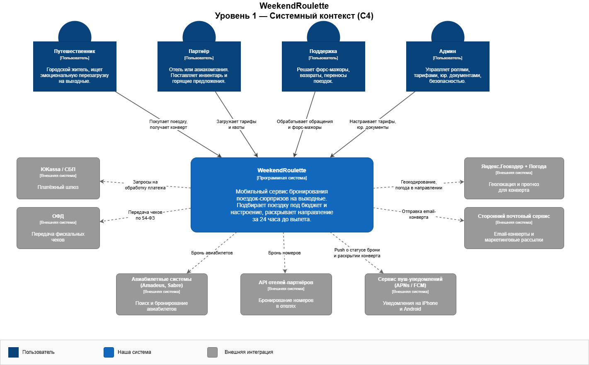
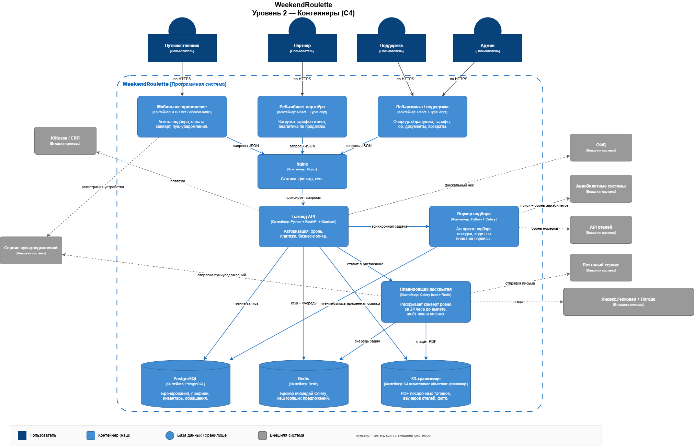

# Практическое задание №4. Архитектура

**Проект:** WeekendRoulette — мобильное приложение бронирования поездок-сюрпризов на выходные.

---

## 1. C4, уровень 1 — Контекст

Показывает систему целиком и её отношения с пользователями и внешними сервисами. Без технологий.

---

## 2. C4, уровень 2 — Контейнеры

Показывает запускаемые приложения внутри системы и стек технологий.

---

## 3. Стек технологий и обоснование

| Слой | Технология | Обоснование |
|---|---|---|
| Мобильный клиент | **Swift (iOS) + Kotlin (Android)** | Нативная производительность критична для анимации «раскрытия конверта» и push-уведомлений. На MVP две команды быстрее одной кросс-платформенной. |
| Веб-кабинеты (партнёр, админка, поддержка) | **React + TypeScript** | Внутренняя аудитория, быстрый CRUD. |
| Reverse proxy | **Nginx** | Точка входа: HTTPS-терминирование, защита от медленных клиентов, отдача статики и подписанных PDF, простой кеш. |
| Backend | **Python 3.12 + FastAPI + Gunicorn** | FastAPI ускоряет API-First (автогенерация Swagger/OpenAPI). Скорость разработки MVP важнее экстремальной нагрузки. На пиках масштабируем горизонтально. |
| Воркер подбора | **Python + Celery** | Задача «подбор сюрприза» тяжёлая (внешние API GDS / отелей) — выносим в отдельный воркер, чтобы не блокировать API. |
| Планировщик «конверта» | **Celery beat + Redis** | Идемпотентные отложенные задачи; переживает рестарты; задачи легко мониторить. |
| Основная БД | **PostgreSQL 16** | PostgreSQL — потому что нужно надёжно хранить деньги и брони (если что-то пойдёт не так — откатить всё одним махом). Плюс умеет хранить гибкие настройки пользователя и работать с координатами для подбора отелей рядом. |
| Кеш + очереди | **Redis** | Брокер для Celery, кеш горящих предложений. |
| Хранилище файлов | **S3-совместимое Object Storage** | Посадочные талоны и ваучеры. |
| Платежи | **ЮKassa + СБП** | Покрывают 99% B2C в РФ; чек уходит в ОФД автоматически. |
| Поставщики инвентаря | **Amadeus / Sabre / прямые отельные API** | Авиа — глобальные GDS, отели — гибридная схема (часть прямых партнёров, часть агрегаторов). |
| Push | **APNs (iOS) + FCM (Android)** | Стандарт. |
| Геокодер и погода | **Яндекс.Геокодер + Яндекс.Погода** | Локальные источники с хорошим покрытием РФ. |
| Наблюдаемость | **Prometheus + Grafana + Sentry** | Чтобы видеть, как приложение живёт в продакшене: Prometheus записывает метрики (нагрузка, ошибки), Grafana рисует по ним графики, Sentry ловит падения мобильного приложения у пользователей. |
| CI/CD | **GitHub Actions + Docker + Kubernetes (Yandex Cloud)** | Чтобы код автоматически проверялся и выкатывался без ручного труда: GitHub Actions гоняет тесты на каждое изменение, Docker упаковывает приложение в «коробку», Kubernetes сам разворачивает её на серверах в Yandex Cloud. |

**Принцип выбора:** «сначала работает — потом правильно — потом быстро». На MVP — Python/FastAPI и монолит с разделением на воркеры. Под нагрузку отдельные горячие сервисы (например, Reveal) можно переписать на Go без переписывания всего бэкенда.
